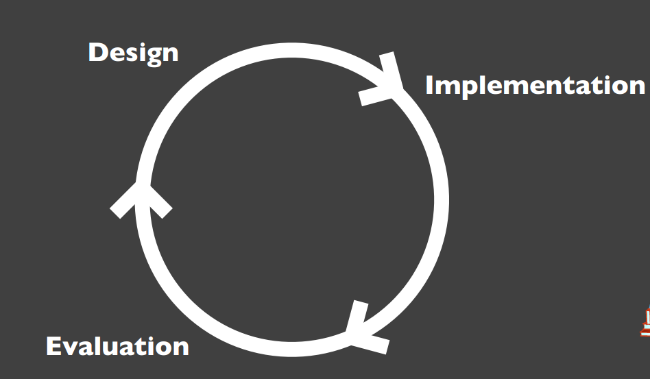

##介绍
- [人机互动](#1)
- [原型的力量](#2)
- [对设计评估](#3)
- [人机交互的诞生](#4)

##人机互动

###好的设计

###糟糕的设计：浪费生命、金钱和时间

###为人设计（Design for People）
- 人的任务、目标和价值驱动开发
- 设计时和用户一起工作
- 从用户、他们的工作和环境来评估决策
- 关注人的能力和形式
- 和专家交流

《The Design of Everyday Things》

##原型的力量

**原型是处理那些很难预测的东西很有效的策略。**

关注目标，进行设计。

**原型设计的准则：**

- 不应该要求完成。
- 应该容易改变
- Gets to retire

**What Do Prototypes Prototype?**

- 感觉：它看起来应该如何？
- 实现：它工作起来如何？
- 作用：用起来体验如何？

“The best way to have a good idea is to have lots of ideas.”
-Linus Pauling

《Sketching User Experiences》

##对设计评估

我们如何衡量成功？

我们如何知道？

**为什么要评估设计？**

关于一个界面你想了解什么？你若何找到这些信息？

- 调查和小组讨论
- 来自专家的反馈
- 比较测试
- 观察
- 仿真和形式模型

**需要考虑的问题：**

- 可靠性和精度
- 普遍性
- 真实性
- 比较
- 涉及工作

你想学到什么？

##人机交互的诞生

图形用户界面（The Graphical User Interface）

鼠标和超文本

“The best way to predict the future is to invent it”

**要了解这段历史可以看：**

- Fred Turner, From Counterculture to Cyberculture
- John Markoff, What the Dormouse Said
- Bill Buxton, Sketching User Experiences
- Johnny Lee, Interface Technologies That Have Not Yet Left The Lab
