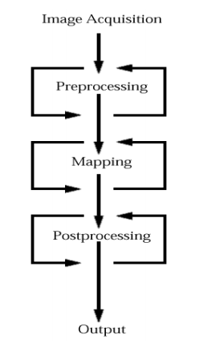

## 图像处理和反锯齿（概述和例子） ##

### 图像处理 ###

### “图像”对于我们以为着什么？ ###

- A 2D domain with samples at regular points (almost always a rectilinear grid)
- 图形单位依赖于应用

### 什么是一个通道？ ###

- 一个通道是所有的采样是一个类型
- 红色通道是一个RGB图片只包括红色采样
- TV通道tuned to different frequencies of electromagnetic waves

### 透明度通道 ###

- 除了一个图片的R、G和B通道外，增加了第四个通道α
- 透明度在0到1之间变化
- 对于混合图片有用

### 创建一个图片 ###

### 离散图像和连续图像 ###

### 图像处理的五个阶段 ###

- 阶段是：
	- 图像获取——我们首先如何获取图像
	- 处理——映射之前应用的任何效果
	- 映射——图像转换和图像组成的所有阶段
	- 后处理——映射后应用的任何效果
	- 输出——打印或显示在屏幕上
- 有些阶段可以略去
- 中间阶段通常交叉使用

### 例子1：边缘检测过滤 ###

### 例子2：图像增强取证 ###

### 图像合成 ###

### 计算机视觉 ###
- 计算机图形是使用模型来创建图形；计算机视觉则相反，根据图像来识别模型
- 计算机要做所有的处理而没有人的干预
- 通常处理技术要很快
	- 速度慢的话会增加系统的camera-to-reaction延迟
- 常见的计算机视觉预处理技术由：
	- 边缘增强
	- 范围检测
	- 对比增强
	- 特征点提取
- 图像处理使得信息容易查找
- 模式检测和模式识别代表着不同的领域
	- 模式检测：查找特征和描述图像的内容
	- 模式识别：分类特征并匹配它们，而不是存储模式
	- 模式检测是模式识别的重要一部分
- 计算机视觉可以作为被动UI的一部分
- 计算摄影学从视觉上吸收了许多技术

### 例子：虚拟吉他 ###

- 实时的计算机视觉系统
- 手势识别

### Microsoft Kinect ###

### 三维图像处理 ###
