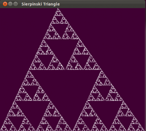

# 1.谢尔宾斯基三角形 #

## 程序sierpinski.cpp ##
 
	#include<GL/glut.h>
	struct Point{
        GLfloat x,y;
        
		Point(GLfloat a,GLfloat b)
        {       x=a;
                y=b;
        }
        
		Point midpoint(Point p)
        {       return Point((x+p.x)/2.0,(y+p.y)/2.0);
        }
	};
	void display()
	{   
		glClear(GL_COLOR_BUFFER_BIT);
        Point vertices[]={Point(0,0),Point(200,500),Point(500,0)};
        Point p=vertices[0];
        glBegin(GL_POINTS);
        for(int i=0;i<20000;i++)
        {       p=p.midpoint(vertices[rand()%3]);
                glVertex2f(p.x,p.y);
        }
        glEnd();
        glFlush();
	}
	
	int main(int argc, char** argv)
	{   glutInit(&argc,argv);
        glutInitDisplayMode(GLUT_SINGLE|GLUT_RGB);
        glutInitWindowSize(500,500);
        glutCreateWindow("Sierpinski Triangle");
        glutDisplayFunc(display);
        gluOrtho2D(0.0,500.0,0.0,500.0);
        glClearColor(0.0,0.0,0.0,1.0);
        glutMainLoop();
	}

## 测试 ##

	# g++ -lGL -lGLU -lglut sierpinski.cpp
	# ./a.out

## 效果 ##
	

### 链接 ###

[Computer Graphics – 2. Sierpinski Triangle](http://www.techtofun.com/2013/08/11/computer-graphics-sierpinski-triangle/)