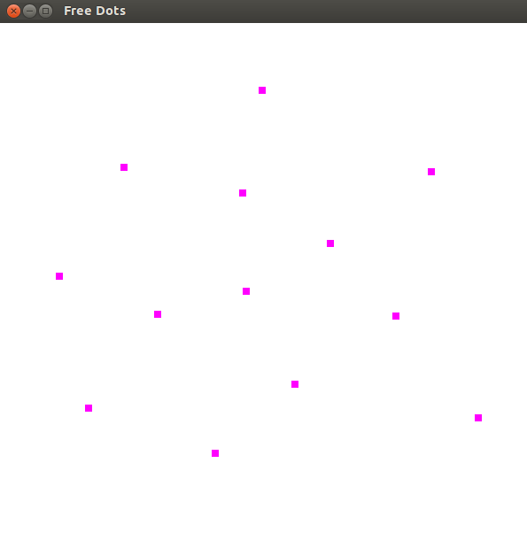

# 8.鼠标点击#

## 程序Dot_on_Click.cpp ##
 
	#include<GL/glut.h>

	GLint screen_height=600;
	GLint screen_width=600;

	void free_dots(void){
		glClear(GL_COLOR_BUFFER_BIT);
		glFlush();
	}

	void point(GLint x, GLint y){
		glBegin(GL_POINTS);
		glColor3f(1.0,0.0,1.0);
		glVertex2d(x,y);
		glEnd();
		glFlush();
	}

	void reshape(GLsizei w, GLsizei h){
		screen_width=w;
		screen_height=h;

		glMatrixMode(GL_PROJECTION);
		glLoadIdentity();
		gluOrtho2D(0,w,0,h);
		glViewport(0,0,w,h);
	}

	void my_mouse(int button, int state, int x, int y){
	
		if((button==GLUT_LEFT_BUTTON) && (state==GLUT_DOWN)){
			point(x, screen_height-y);
		}
		else if((button==GLUT_RIGHT_BUTTON)&&(state==GLUT_DOWN)){
			glClear(GL_COLOR_BUFFER_BIT);
			glFlush();
		}
	}

	void init(){
		glClearColor(1.0f,1.0f,1.0f,0.0f);
		glColor3f(0.0f,0.0f,0.0f);
		glPointSize(8);

		glMatrixMode(GL_PROJECTION);
		glLoadIdentity();
		gluOrtho2D(0,screen_width,0,screen_height);
	}

	int main(int argc,char **argv){
		glutInit(&argc,argv);
		glutInitWindowSize(600,600);
		glutInitWindowPosition(60,60);
		glutInitDisplayMode(GLUT_SINGLE|GLUT_RGB);
		glutCreateWindow("Free Dots");

		glutDisplayFunc(free_dots);
		glutMouseFunc(my_mouse);
		glutReshapeFunc(reshape);

		init();

		glutMainLoop();
		return 0;
	}

## 测试 ##

	# g++ -lGL -lGLU -lglut Dot_on_Click.cpp
	# ./a.out

## 效果 ##
	

### 链接 ###

[Computer Graphics – 8. Dot on Mouse Click](http://www.techtofun.com/2013/08/15/computer-graphics-8-dot-on-mouse-click/)