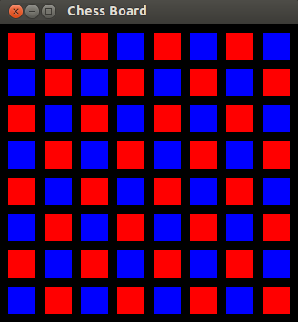

# 9.棋盘#

## 程序Chess_Board_Colored.cpp ##
 
	#include<GL/glut.h>
 
	void chess_board(void){
	    glClear(GL_COLOR_BUFFER_BIT);
	    int y=290,s=30,c=0,r=0,x;
	    while(r<8){
	        x=10;
	        while(c<8){
	            if((c+r)%2==0)
	                glColor3f(1.0,0.0,0.0);
	            else
	                glColor3f(0.0,0.0,1.0);
	            glRecti(x,y,x+30,y+30);
	            x+=40;
	            c+=1;
	        }
	        c=0;y-=40;
	        r+=1;
	    }
	    glFlush();
	}
	int main(int argc,char **argv){
	    glutInit(&argc,argv);
	    glutInitWindowSize(330,330);
	    glutInitDisplayMode(GLUT_SINGLE|GLUT_RGB);
	    glutCreateWindow("Chess Board");
	     
	    glutDisplayFunc(chess_board);
	    glClearColor(0.0,0.0,0.0,0.0);
	    gluOrtho2D(0,330,0,330);
	    glutMainLoop();
	}

## 测试 ##

	# g++ -lGL -lGLU -lglut Chess_Board_Colored.cpp
	# ./a.out

## 效果 ##
	

### 链接 ###

[Computer Graphics – 9. (ii) Chess Board Colored](http://www.techtofun.com/2013/08/16/computer-graphics-9-ii-chess-board-colored/)